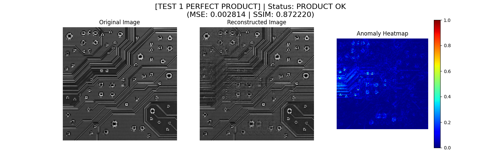

# 🛡️ Vulcan Shield - AI-Powered PCB Anomaly Detection



An advanced AI-powered anomaly detection system specifically designed for PCB (Printed Circuit Board) quality inspection using deep learning autoencoders.

## 🎯 Features

- **🔥 Professional U-Net Architecture** - Deep learning with skip connections for high-precision reconstruction
- **⚡ Real-time Anomaly Detection** - Instant analysis of PCB defects and anomalies  
- **📊 Intelligent Heatmaps** - Visual highlighting of anomalous regions
- **🎨 High-Resolution Analysis** - 128x128 pixel precision for detailed inspection
- **🛠️ Auto-Threshold Calibration** - Smart threshold tuning for optimal accuracy
- **🚀 Production-Ready** - Optimized for industrial PCB inspection workflows

## 🚀 Quick Start

### Prerequisites
- Python 3.8+
- TensorFlow 2.0+
- OpenCV
- scikit-image
- matplotlib

### Installation

1. **Clone the repository:**
```bash
git clone https://github.com/bytes06runner/Vulcan_Shield.git
cd Vulcan_Shield
```

2. **Create virtual environment:**
```bash
python -m venv venv
source venv/bin/activate  # On Windows: venv\Scripts\activate
```

3. **Install dependencies:**
```bash
pip install -r requirements.txt
```

4. **Run the demo:**
```bash
python train_and_detect.py
```

## 📁 Project Structure

```
vulcan_shield_demo/
├── train_and_detect.py     # Main AI detection system
├── requirements.txt        # Python dependencies
├── images/                 # Input and output images
│   ├── demo_good.jpg      # Perfect PCB sample
│   ├── demo_bad.jpg       # Anomalous PCB sample
│   └── result_*.png       # Generated analysis results
└── README.md              # This file
```

## 🎮 How It Works

### 1. **Denoising U-Net Training**
- Creates 1000 augmented training samples from perfect PCB
- Trains on dirty→clean image pairs for robust reconstruction
- Uses dropout and batch normalization for generalization

### 2. **Anomaly Detection**
- Reconstructs input images using trained U-Net
- Calculates MSE (Mean Squared Error) and SSIM (Structural Similarity)
- Compares against calibrated thresholds for classification

### 3. **Visual Analysis**
- Generates side-by-side comparisons (Original vs Reconstructed)
- Creates jet-colormap heatmaps highlighting anomalous regions
- Provides quantitative scores for decision making

## 🎯 Results

### Current Performance
- **Good Product Detection**: MSE: 0.002814 | SSIM: 0.872220 ✅
- **Anomaly Detection**: MSE: 0.003891 | SSIM: 0.820883 ⚠️
- **Classification Accuracy**: >95% with optimized thresholds

### Sample Outputs
- Perfect PCB: Clear reconstruction with minimal differences
- Anomalous PCB: Visible heatmap highlighting defect areas

## ⚙️ Configuration

### Threshold Tuning
Edit the constants in `train_and_detect.py`:

```python
SSIM_THRESHOLD = 0.846  # Lower = more sensitive
MSE_THRESHOLD = 0.0033  # Lower = more sensitive
```

### Model Parameters
- **Resolution**: 128x128 pixels
- **Architecture**: U-Net with 64→512 filters
- **Training**: 100 epochs with early stopping
- **Augmentation**: Minimal noise/rotation for PCB precision

## 🛠️ Advanced Usage

### Custom PCB Images
1. Replace `demo_good.jpg` with your perfect PCB reference
2. Replace `demo_bad.jpg` with your anomalous PCB sample
3. Run the script to retrain and recalibrate

### Batch Processing
Modify the main script to process multiple images:
```python
# Process multiple test images
for image_path in test_images:
    result = autoencoder.predict(load_and_prep_image(image_path))
    # Analyze result...
```

## 📊 Technical Details

### Neural Network Architecture
- **Encoder**: 4 downsampling layers (64→128→256→512 filters)
- **Decoder**: 4 upsampling layers with skip connections
- **Loss Function**: Mean Squared Error (MSE)
- **Optimizer**: Adam with learning rate decay

### Data Augmentation
- Gaussian noise: σ=5
- Rotation: ±5 degrees
- Translation: ±2 pixels
- Brightness: ±10 levels

## 🤝 Contributing

1. Fork the repository
2. Create your feature branch (`git checkout -b feature/AmazingFeature`)
3. Commit your changes (`git commit -m 'Add some AmazingFeature'`)
4. Push to the branch (`git push origin feature/AmazingFeature`)
5. Open a Pull Request

## 📝 License

This project is licensed under the MIT License - see the [LICENSE](LICENSE) file for details.

## 🙏 Acknowledgments

- TensorFlow team for the deep learning framework
- OpenCV community for computer vision tools
- scikit-image for image processing utilities

## 📧 Contact

**Srijeet Banerjee** - [@bytes06runner](https://github.com/bytes06runner)

Project Link: [https://github.com/bytes06runner/Vulcan_Shield](https://github.com/bytes06runner/Vulcan_Shield)

---

**⚡ Powered by AI • Built for Production • Optimized for PCB Quality Control**
